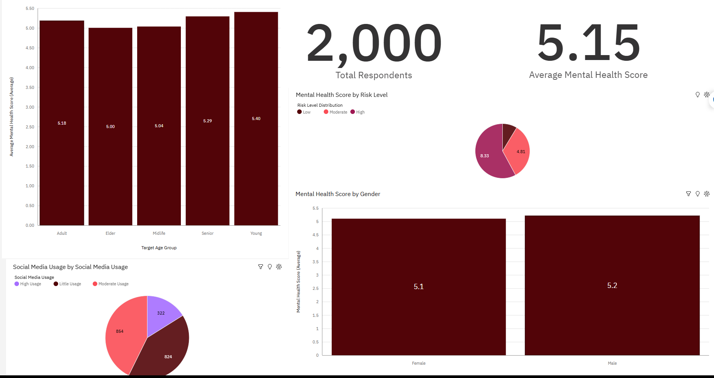
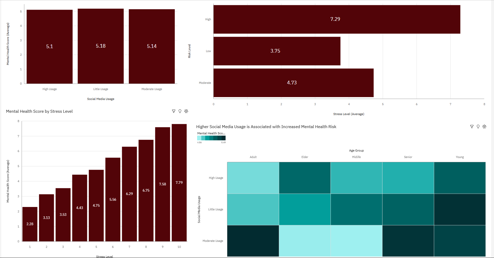

##Mental Health Data

This project uses a structured dataset of individuals in various age groups to investigate the relationship between social media use and mental health outcomes. In order to present a more comprehensive picture of general well-being, the research focuses on important markers, including stress levels, anxiety, and depression, which were aggregated into a composite Mental Health Score. A deeper awareness of trends in the data was made possible by additional transformations, such as grouping users into low, moderate, and high usage groups and classifying people into risk categories.

This project aims to find significant patterns and connections between behavioral characteristics and mental health, specifically investigating if greater use of social media is linked to elevated stress levels and general mental health risk. This project provides both high-level KPIs and in-depth analytical views to support data-driven insights by utilizing IBM Cognos Analytics for visualization and Excel for data preparation.

# Mental Health KPI #

-The Elder Age Group has the lowest Mental Health Score at 5.0, while the Young Age Group has the highest Mental Health Score of 5.4. 
-According to the data, Adult Men have around 8.5% higher stress level scores compared to Adult Women.
-Men in general exceed Females in their Mental Health Scores by 1.9%. Displaying that Men are slightly more stressed out than Females.

**Mental Health Score Dashboard**

