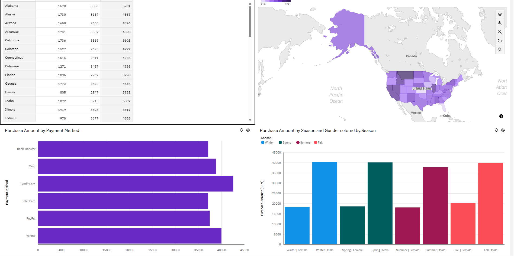

Created Read me File for Excel visualization

This dashboard analyzes customer purchasing behavior across states, payment methods, and seasonal trends.

There is a significant gender-based purchasing disparity in Missouri, where male consumers make 73.3% larger purchases than female consumers.
West Virginia is the biggest contributing location, indicating concentrated high-value purchasing in particular areas. Overall, male customers provide the largest total purchase amount.
According to a review of payment methods, credit cards account for about $43K in sales, with Venmo coming in second at about $40K. This indicates that both traditional and digital payment methods are widely used.

Here is the link to my IBM Cogno Analytics Dashboards for Shopping Trends in the United States. 

https://us3.ca.analytics.ibm.com/bi/?perspective=dashboard&pathRef=.my_folders%2FPortfolio%2BAnalysis%2FDashboard%2Bview%2Bof%2BShopping%2BTrends%2BDashboard&action=view&mode=dashboard&subView=model0000019db1cfe750_00000002&nav_filter=true
