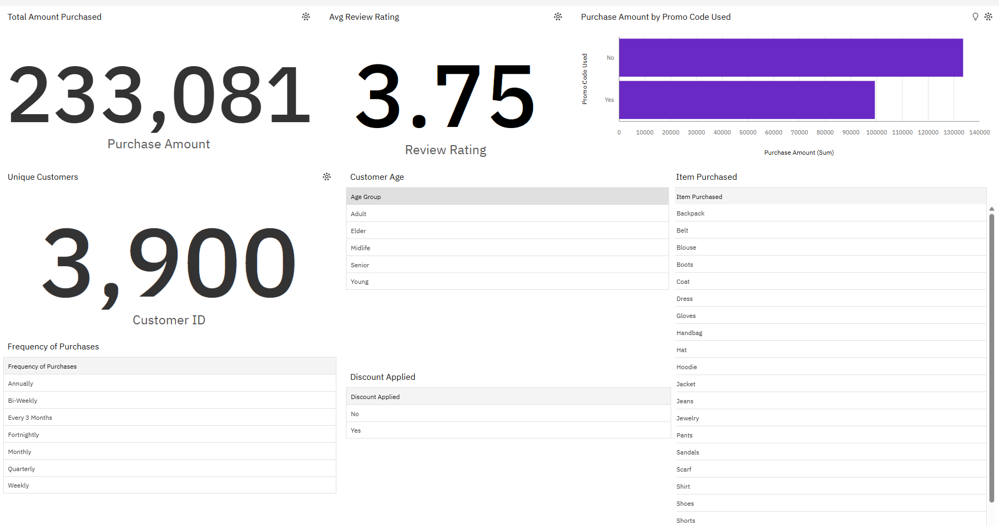
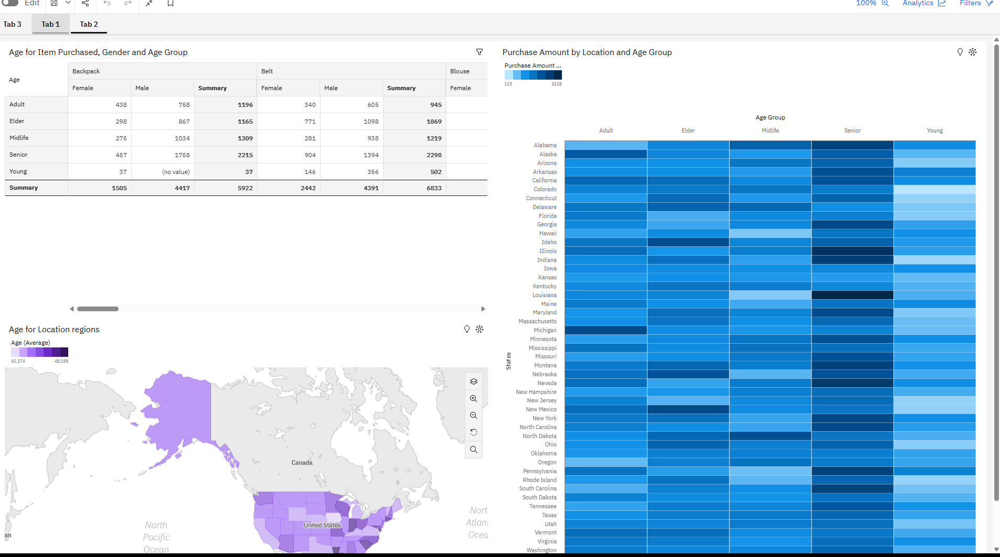
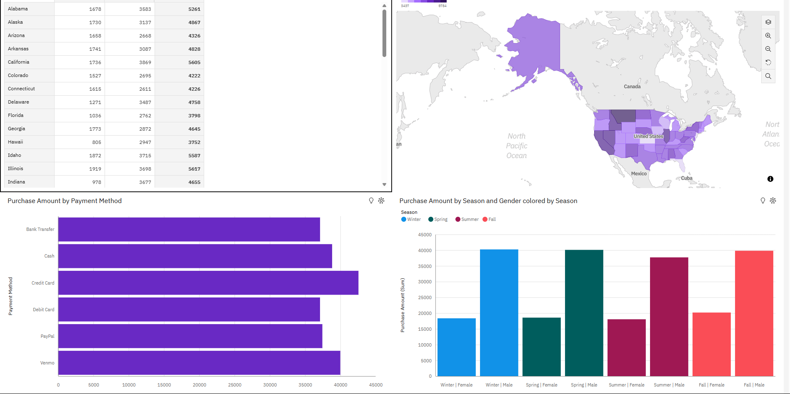

# Business Data Analytics & Dashboard Portfolio : Shopping Trends 🛒

I have created data dashboards that address actual business inquiries by going beyond visuals. I've prepared raw datasets for analysis by cleaning and organizing them using applications such as Excel and Cognos Analytics, transforming them into insightful tables and visualizations. I've analyzed thousands of client records for several projects in order to gain insights into customer experience, purchase patterns, and spending amounts. Thus, identifying business trends, assessing tactics including discounting, and transforming data into understandable, insightful information for end users. 

##  1. KPI DashBoard

**Key Insights:**
- There are over 200,000 purchases from this dataset.
- The average rating across all purchases is 3.75 out of 5 stars
- The amount of purchases that did not use discounts compared to those who do is 25.6%
- Business is not overly dependent on discounts based on Promo Code usage

## 👥 2. Age Group Analysis

**Key Insights:**
- Customers aged 25–34 are the highest spending group. This group, labeled as Adults, has made a total of 2,462 among all age groups in the DataSet. 
- The Heat Map shows that the Age Group Seniors in Montana is the highest contributing Group in that State.   
- The Blouse has the highest Purchase Amount at over 10 thousand, out of which the age group midlife contributed the most at over 2,500.

**Additional Insights:**

- This analysis reveals distinct regional and demographic trends in consumer purchasing behavior. The Young age group contributes the least, while the Senior and Midlife age groups have the largest purchase activity, suggesting that older consumers have more purchasing power.
- Across all product categories, male consumers consistently produce larger purchase volumes, especially for products like belts and backpacks. The age distribution of customers varies by state, according to a geographic study, with some areas—most notably Texas, California, and Florida—showing higher purchasing intensity and a wider range of age involvement.
- Overall, the heatmap confirms that location and age have a significant impact on purchase behavior, with clear regional and demographic variations influencing total sales success.

## 🛒 3. Purchase Behavior Dashboard

**Key Insights:**
- Credit cards are the most used payment method, with 42,567 uses across all payment methods. 
- Across all seasons, Men are dominating sales, with Winter being the most profitable season for men, with 40,247 purchases. For Women, Fall appears to be their most profitable season with 20,193 purchases.
- Geographic differences show strong regional variation in sales

**Additional Insights:**

*There is a significant gender-based purchasing disparity in Missouri, where male consumers make 73.3% larger purchases than female consumers.

*West Virginia is the biggest contributing location, indicating concentrated high-value purchasing in particular areas. Overall, male customers provide the largest total purchase amount.

*According to a review of payment methods, credit cards account for about $43K in sales, with Venmo coming in second at about $40K. This indicates that both traditional and digital payment methods are widely used.

Here is the link to my IBM Cogno Analytics Dashboards for Shopping Trends in the United States. 

https://us3.ca.analytics.ibm.com/bi/?perspective=dashboard&pathRef=.my_folders%2FPortfolio%2BAnalysis%2FDashboard%2Bview%2Bof%2BShopping%2BTrends%2BDashboard&action=view&mode=dashboard&subView=model0000019db1cfe750_00000002&nav_filter=true
